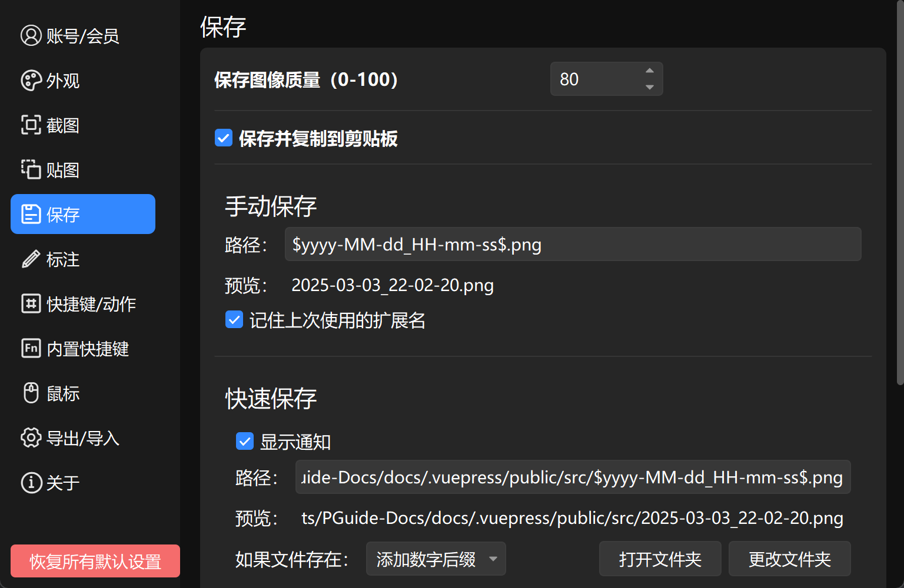
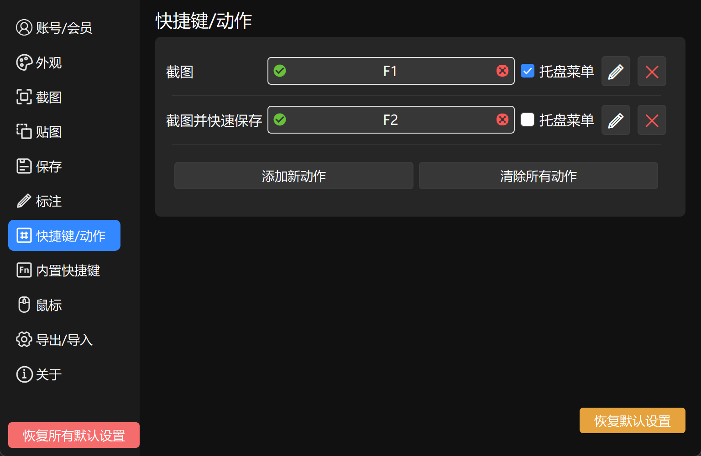

# 项导文档

人人为我，我为人人。身在互联网的开源时代，我们深知互帮互助、共同进步的重要意义，这篇文档凝聚了同学和老师们的集体智慧，希望能对您有所帮助。

## 依赖环境
- Node.js v18.20.0+ 
- pnpm 8+ 或 Yarn 2+

## 项目结构

`docs`: 静态编译的网站页面内容

`.vuepress`
 - `public/`: 静态资源文件夹
 - `theme`: 主题参数设置文件夹
 - client.ts: 客户端配置文件
 - config.ts: 全局配置文件
 - navbar.ts: 导航栏配置文件
 - notes.ts: 文档结构配置文件
 - plume.config.ts: 主题配置文件

## 项目安装
- 推荐使用nvm做Node.js环境管理
  - [nvm windows](https://github.com/coreybutler/nvm-windows)
- IDE:WebStorm 或 VSCode


- 使用nvm安装npm
    ```shell
    nvm install lts
    ```
  - 配置NodeJS Release 软件仓库镜像
    - 校园网联合镜像站：
    参考 [https://help.mirrors.cernet.edu.cn/nodejs-release/](https://help.mirrors.cernet.edu.cn/nodejs-release/)

      ```shell
      nvm node_mirror https://mirrors.cernet.edu.cn/nodejs-release/
      ```
    - 阿里云
      ```shell
      nvm node_mirror https://mirrors.aliyun.com/nodejs-release/
      ```
- 全局安装pnpm
    ```shell
    npm install -g pnpm
    ```
- 安装pnpm依赖
    ```shell
    pnpm i
    ```
- 启动项目开发环境
    ```shell
    pnpm run docs:dev
    ```

## 创建合并请求
- 首先需要拉取远程仓库代码到本地仓库
- Local本地新建dev/***[你的分支名]
- 对新建分支内项目修改之后，进行commit push
  (快捷键 ctrl + shift + K)
- push时简介说明参考：[AngluarCommit Standard](https://zj-git-guide.readthedocs.io/zh-cn/latest/message/Angular%E6%8F%90%E4%BA%A4%E4%BF%A1%E6%81%AF%E8%A7%84%E8%8C%83/)
  (如：此处修改readme，便书写docs:README 新增项目启动介绍)
- 注意在提交时查看上传平台,github存储开发环境的所有分支，gitlab存放CI通过后的master分支

- 进入github等平台仓库，点击Pull requests，点击New pull request可见提交的PR，输入此次PR提交的内容即可，图片展示可见：

<CardGrid>

</CardGrid>

## 文件路径配置

首先在 `docs/.vuepress/notes.ts` 中配置notes的路径

## 其他注意事项
- 所有静态文件放在`docs/.vuepress/public`中
- 其他地方引用静态文件时，从相对路径public开始
  - 例如:public下有AI.svg文件，引用时使用 `AI.svg` 路径即可
  - 头像放在`avatar`中
- markdown文档隔行写
- 请将`public`文件夹设置为 **Excluded**：右键 -> mark as -> excluded folder
  - 否则svg等静态文件的命名空间等信息会报错。
- 永久链接 permalink 注意末尾不要缺少 " / " 表示请求路径
- 修改头部导航栏的时候记得重启项目
- 请从二级标题开始写，一级标题在正文不渲染
- 如果网页渲染重复，请重启服务器
- 在开始你所在分支的开发之前，请先检查master分支是否有更新，有则update → rebase

- Giscus的跨域报错不用管


- 视频文件保存为mp4，放到`src/video`下
- 统一用permalink作为请求路径
- pnpm包不一致时，项目无法启动
```shell
pnpm update
pnpm upgrade
```
### Pixpin配置



按下F2即可快速保存

## Q&A
### git进行push报错

- fatal: unable to access 'https://github.com/xxxxx/xxxx.git/': OpenSSL SSL_read: SSL_ERROR_SYSCALL, errno 0

1. 检查Clash代理设置

- **确保Clash已启动**：
  确保Clash程序正在运行并且已激活代理。

- **确认代理端口**：
  确保你在Clash中配置的HTTP或SOCKS代理的端口是正确的（比如7890或7891）。可以在Clash的配置界面或日志中查看当前的代理设置。

- **检查Clash的代理规则**：
  确保你的代理规则能够正确处理到GitHub的请求。

2. 测试代理连接

在终端中使用`curl`命令，测试代理是否能够正常工作：

- 如果使用HTTP代理：

  ```bash
  curl -x http://127.0.0.1:7890 https://github.com
  ```

- 如果使用SOCKS代理：

  ```bash
  curl -x socks5://127.0.0.1:7891 https://github.com
  ```

配置clash本地代理方法：

```shell
git config --global http.proxy http://127.0.0.1:7890
git config --global https.proxy https://127.0.0.1:7890
```

如果能够成功响应，说明代理正常。如果不能，说明可能是Clash的设置问题。

3. 直接访问GitHub

通过浏览器直接访问`https://github.com`看是否可以连接。如果可以，而Git无法连接，可能是Git配置的问题。

4. 检查Git的SSL设置

在某些情况下，Git的SSL设置可能会影响连接：

```bash
git config --global http.sslVerify false
```

> **注意**：禁用SSL验证会影响安全性，通常不建议这样做。

5. 更新Git版本

确保你的Git是最新版本。有时，较旧版本的Git可能会与代理服务器不兼容。

6. 确保没有其他代理干扰

确认没有其他程序（如VPN或其他代理）干扰Git的连接。

7. 尝试其他Git协议

如果使用HTTPS存在问题，尝试SSH。如果你的GitHub账号已经配置了SSH密钥，可以使用SSH方式克隆仓库：

```bash
git clone git@github.com:MultipledMe/PGuide-Docs.git
```

8. 重新配置Git代理

如果以上步骤都无法解决问题，可以尝试重新配置Git的代理设置，确保没有任何拼写错误或其他问题：

```bash
git config --global --unset http.proxy
git config --global --unset https.proxy
# 然后再重新设置
git config --global http.proxy http://127.0.0.1:7890
git config --global https.proxy http://127.0.0.1:7890
```


