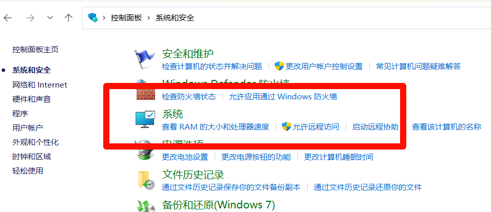
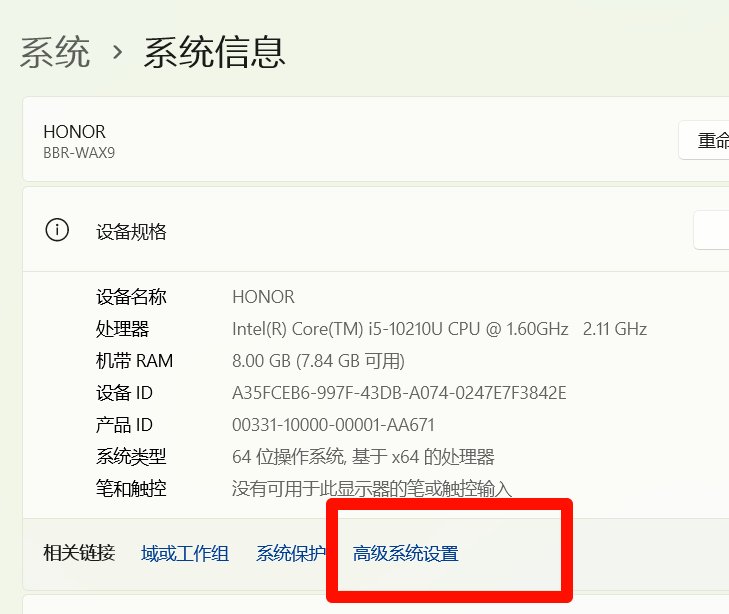
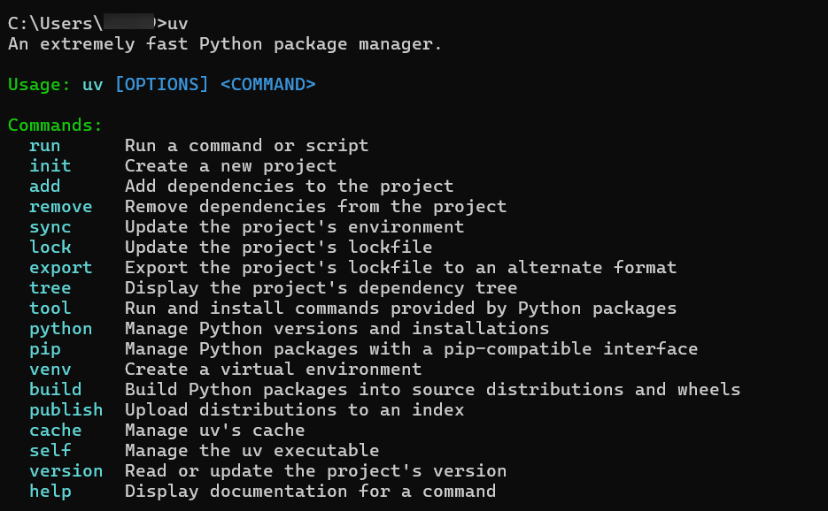
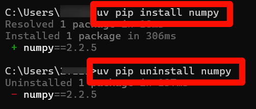

对于Python而言，现在出现了许许多多新型的包管理器(package manager)，编者目前最推荐 uv。

编写者：[::noto:red-heart:: Lily, rand777  ](/friends/persons/)                        


## UV 从安装到使用

[https://docs.astral.sh/uv/getting-started/installation/](https://docs.astral.sh/uv/getting-started/installation/)
### 安装

#### Windows
* 通过pip安装(推荐)

1.打开命令提示符，输入以下命令

```python
pip install uv
```
安装成功后，将uv添加到环境变量，这样即使切换到虚拟环境也可以使用:

2.打开命令提示符窗口，输入

```python
where uv
```
找到uv的存储位置并复制到文件资源管理器的搜索栏，

[lwj2024223201](../../../../../../../../../java%E6%95%B0%E6%8D%AE%E5%AD%98%E6%94%BE/untitled2222222222/lwj2024223201)


3.直接在电脑搜索栏中，搜索"控制面板"，打开"控制面板"

4.点击"系统与安全"


5.点击"系统"



6.点击"高级系统"



7.点击"环境变量"


8.点击"Path",点击"编辑"


9.点击"新建",粘贴复制的Scripts文件地址，然后一路点确定


10.最后打开一个新的命令提示符窗口，输入以下命令，验证更改

```python
uv
```



出现这样的信息则表示添加成功

* PowerShell脚本安装

1.打开PowerShell,执行以下代码:

```python
irm https://astral.sh/uv/install.ps1 | iex
```
2.输入以下代码查看是否安装成功:

```python
uv --version
```

这样就可以查看安装的UV版本

* 使用pipx:

```python
pipx install uv
```

安装完成后打开新的终端窗口，运行uv --version来验证是否安装成功

#### Linux 

1.打开终端，输入以下命令:

```python
sudo apt install curl
curl -LsSf https://astral.sh/uv/install.sh | sh
```


输入以下命令验证是否安装成功:

```python
uv --version
```


若显示uv的版本信息，则表示安装成功

### UV的基础用法

1.创建虚拟环境

打开命令提示符，输入以下命令,创建虚拟环境:

```python
uv venv .venv
```

激活环境:
```python
.venv\Scripts\activate
```


2.兼容pip常用命令

```python
#安装一个包
uv pip install <package>
```

```python
#卸载包
uv pip uninstall <package>
```



3.依赖编译和锁定

```python
#使用uv pip freeze >命令生成requirements.txt文件，这个命令会列出当前虚拟环境中所有已安装的包以及版本号，并将它们写入到文件中
uv pip freeze >requirements.txt
```
```python
#uv pip compile会读取requirements.txt文件中的依赖
uv pip compile requirments.txt -o require
```


4.本地项目包管理

如果你需要管理本地项目依赖，可以使用uv add命令

```python
uv add numpy
```


### 小结

UV是是一个用Rust编写的现代Python打包工具，它的核心目标是极速替代pip、pip-tools和venv等工具的功能。

如果你厌倦了等待pip解析和安装依赖，那么uv绝对值得你尝试。开始使用uv venv和uv pip install,体验一下“瞬间”完成依赖安装的快感吧！


## 配置镜像

参考[PYPI镜像配置](/public-service/cqmu-mirror/wiki/#pypi)