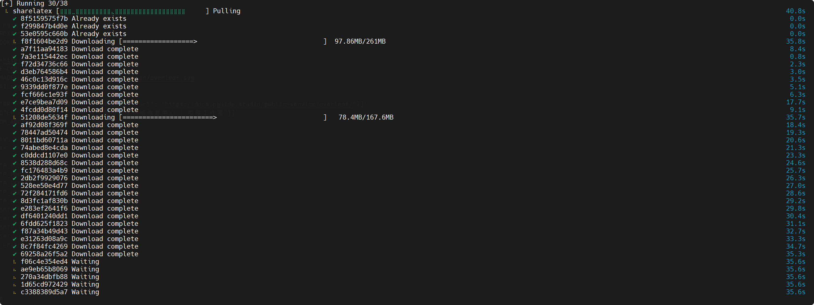
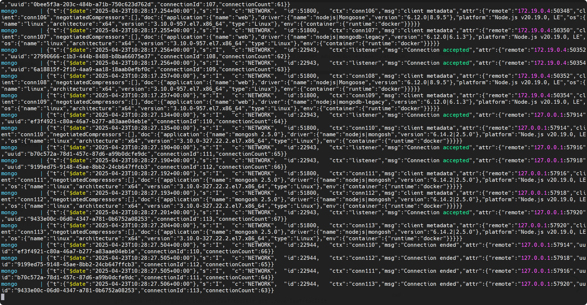
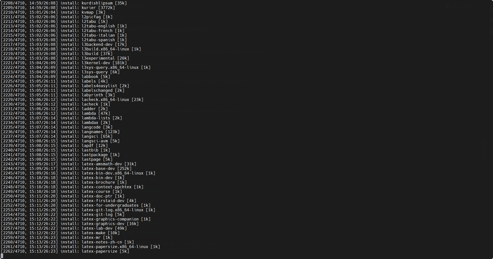
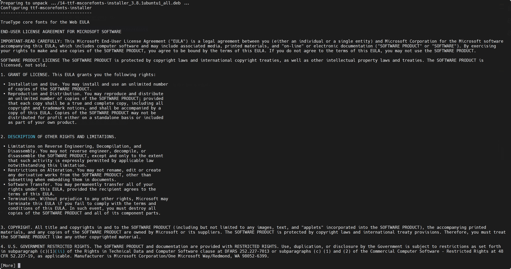

> 本文是面向Overleaf LaTeX协作平台的维护与开发手册，本人在无数次日日夜夜的尝试和知识积累中编出，参考了大量网络资料，管理员和有志于自行运营Overleaf的开发者可以参考本文。

:::tip 前置知识

- [LaTeX](/csdiy/tools-must/latex/)
- [Git](/csdiy/tools-must/git/)
- [Docker](/csdiy/tools-must/docker/)
- [Linux命令](/learning-notes/linux/commands/)


:::

## 安装Docker CE

> 参考计算机必学工具 [:[catppuccin:docker-compose]:安装Docker CE](/csdiy/tools-must/docker/#安装docker-ce)

主容器为Ubuntu24.04 LTS noble(输入`lsb_release -a`查看)，首先配置Ubuntu的软件镜像源(需要sudo权限)。而从 Ubuntu 24.04 开始，Ubuntu 的软件源配置文件变更为 DEB822 格式，路径为 /etc/apt/sources.list.d/ubuntu.sources

:::code-tabs

@tab DEB822 格式配置.sh

```shell :collapsed-lines
echo 'Types: deb
URIs: https://mirrors.cernet.edu.cn/ubuntu
Suites: noble noble-updates noble-backports
Components: main restricted universe multiverse
Signed-By: /usr/share/keyrings/ubuntu-archive-keyring.gpg

# 默认注释了源码镜像以提高 apt update 速度，如有需要可自行取消注释
# Types: deb-src
# URIs: https://mirrors.cernet.edu.cn/ubuntu
# Suites: noble noble-updates noble-backports
# Components: main restricted universe multiverse
# Signed-By: /usr/share/keyrings/ubuntu-archive-keyring.gpg

# 以下安全更新软件源包含了官方源与镜像站配置，如有需要可自行修改注释切换
# Types: deb
# URIs: https://mirrors.cernet.edu.cn/ubuntu
# Suites: noble-security
# Components: main restricted universe multiverse
# Signed-By: /usr/share/keyrings/ubuntu-archive-keyring.gpg

# # Types: deb-src
# # URIs: https://mirrors.cernet.edu.cn/ubuntu
# # Suites: noble-security
# # Components: main restricted universe multiverse
# # Signed-By: /usr/share/keyrings/ubuntu-archive-keyring.gpg

Types: deb
URIs: http://security.ubuntu.com/ubuntu/
Suites: noble-security
Components: main restricted universe multiverse
Signed-By: /usr/share/keyrings/ubuntu-archive-keyring.gpg

# Types: deb-src
# URIs: http://security.ubuntu.com/ubuntu/
# Suites: noble-security
# Components: main restricted universe multiverse
# Signed-By: /usr/share/keyrings/ubuntu-archive-keyring.gpg

# 预发布软件源，不建议启用
# Types: deb
# URIs: https://mirrors.cernet.edu.cn/ubuntu
# Suites: noble-proposed
# Components: main restricted universe multiverse
# Signed-By: /usr/share/keyrings/ubuntu-archive-keyring.gpg

# # Types: deb-src
# # URIs: https://mirrors.cernet.edu.cn/ubuntu
# # Suites: noble-proposed
# # Components: main restricted universe multiverse
# # Signed-By: /usr/share/keyrings/ubuntu-archive-keyring.gpg
' | tee /etc/apt/sources.list.d/ubuntu.sources
```


@tab 传统格式配置.sh

```shell :collapsed-lines
echo '# 默认注释了源码镜像以提高 apt update 速度，如有需要可自行取消注释
deb https://mirrors.cernet.edu.cn/ubuntu/ noble main restricted universe multiverse
# deb-src https://mirrors.cernet.edu.cn/ubuntu/ noble main restricted universe multiverse
deb https://mirrors.cernet.edu.cn/ubuntu/ noble-updates main restricted universe multiverse
# deb-src https://mirrors.cernet.edu.cn/ubuntu/ noble-updates main restricted universe multiverse
deb https://mirrors.cernet.edu.cn/ubuntu/ noble-backports main restricted universe multiverse
# deb-src https://mirrors.cernet.edu.cn/ubuntu/ noble-backports main restricted universe multiverse

# 以下安全更新软件源包含了官方源与镜像站配置，如有需要可自行修改注释切换
# deb https://mirrors.cernet.edu.cn/ubuntu/ noble-security main restricted universe multiverse
# # deb-src https://mirrors.cernet.edu.cn/ubuntu/ noble-security main restricted universe multiverse

deb http://security.ubuntu.com/ubuntu/ noble-security main restricted universe multiverse
# deb-src http://security.ubuntu.com/ubuntu/ noble-security main restricted universe multiverse

# 预发布软件源，不建议启用
# deb https://mirrors.cernet.edu.cn/ubuntu/ noble-proposed main restricted universe multiverse
# # deb-src https://mirrors.cernet.edu.cn/ubuntu/ noble-proposed main restricted universe multiverse
' | tee /etc/apt/sources.list
```


:::


其他软件源配置参考：:[https://help.mirrors.cernet.edu.cn/favicon/android-icon-192x192.png]:[MirrorZ help Ubuntu](https://help.mirrors.cernet.edu.cn/ubuntu/)

## 导入Overleaf Tookit

<RepoCard repo="overleaf/toolkit"></RepoCard>

### git克隆仓库

```shell
git clone https://github.com/overleaf/toolkit.git ./overleaf-toolkit
```

```shell
cd overleaf-toolkit
```

初始化项目

```shell
bin/init
```

初次启动容器，包含mongodb、redis、sharelatex

```shell
bin/up
```

等待拉取完成所有镜像



启动完成后显示下图即为成功


停止容器

按ctrl + C

### 查看占用

```shell
docker stats
```

> 整个业务系统占用不超过2GB

| 名称         | CPU使用率 | 内存使用     | 内存限制     | 内存使用率  | 网络接收   | 网络发送   | 块IO读   | 块IO写   | PIDS |
|------------|--------|----------|----------|--------|--------|--------|--------|--------|------|
| sharelatex | 4.98%  | 612.1MiB | 1.795GiB | 33.31% | 36.7MB | 20.9MB | 2.86GB | 3.69MB | 158  |
| redis      | 0.14%  | 2.883MiB | 1.795GiB | 0.16%  | 1.25MB | 1.5MB  | 214MB  | 1.88MB | 6    |
| mongo      | 41.33% | 80.73MiB | 1.795GiB | 4.39%  | 8.9MB  | 35.2MB | 4.06GB | 112MB  | 118  |

## 配置Overleaf

`cd config`进入配置文件夹

### overleaf.rc

```shell :collapsed-lines
#### Overleaf RC ####

PROJECT_NAME=

# Sharelatex container
# Uncomment the OVERLEAF_IMAGE_NAME variable to use a user-defined image.
# OVERLEAF_IMAGE_NAME=
OVERLEAF_DATA_PATH=
SERVER_PRO=
OVERLEAF_LISTEN_IP=
OVERLEAF_PORT=

# Sibling Containers
SIBLING_CONTAINERS_ENABLED=
DOCKER_SOCKET_PATH=

# Mongo configuration
MONGO_ENABLED=
MONGO_DATA_PATH=
MONGO_IMAGE=
MONGO_VERSION=

# Redis configuration
REDIS_ENABLED=
REDIS_DATA_PATH=
REDIS_IMAGE=
REDIS_AOF_PERSISTENCE=

# Git-bridge configuration (Server Pro only)
GIT_BRIDGE_ENABLED=
GIT_BRIDGE_DATA_PATH=

# TLS proxy configuration (optional)
# See documentation in doc/tls-proxy.md
NGINX_ENABLED=
NGINX_CONFIG_PATH=
NGINX_HTTP_PORT=
# Replace these IP addresses with the external IP address of your host
NGINX_HTTP_LISTEN_IP=
NGINX_TLS_LISTEN_IP=
TLS_PRIVATE_KEY_PATH=
TLS_CERTIFICATE_PATH=
TLS_PORT=

# In Air-gapped setups, skip pulling images
# PULL_BEFORE_UPGRADE=
# SIBLING_CONTAINERS_PULL=
```

### varibles.env 

```shell :collapsed-lines
OVERLEAF_APP_NAME=

ENABLED_LINKED_FILE_TYPES=

# Enables Thumbnail generation using ImageMagick
ENABLE_CONVERSIONS=

# Disables email confirmation requirement
EMAIL_CONFIRMATION_DISABLED=

## Nginx
# NGINX_WORKER_PROCESSES=
# NGINX_WORKER_CONNECTIONS=

# Set for TLS via nginx-proxy
# OVERLEAF_BEHIND_PROXY=
# OVERLEAF_SECURE_COOKIE=

OVERLEAF_SITE_URL=
OVERLEAF_NAV_TITLE=
OVERLEAF_HEADER_IMAGE_URL=
OVERLEAF_ADMIN_EMAIL=

OVERLEAF_LEFT_FOOTER=
OVERLEAF_RIGHT_FOOTER=
OVERLEAF_EMAIL_FROM_ADDRESS=

# OVERLEAF_EMAIL_AWS_SES_ACCESS_KEY_ID=
# OVERLEAF_EMAIL_AWS_SES_SECRET_KEY=

OVERLEAF_EMAIL_SMTP_HOST=
OVERLEAF_EMAIL_SMTP_PORT=
OVERLEAF_EMAIL_SMTP_SECURE=
OVERLEAF_EMAIL_SMTP_USER=
OVERLEAF_EMAIL_SMTP_PASS=
# OVERLEAF_EMAIL_SMTP_NAME=
# OVERLEAF_EMAIL_SMTP_LOGGER=
# OVERLEAF_EMAIL_SMTP_TLS_REJECT_UNAUTH=
# OVERLEAF_EMAIL_SMTP_IGNORE_TLS=
# OVERLEAF_CUSTOM_EMAIL_FOOTER=

################
## Server Pro ##
################

EXTERNAL_AUTH=none
# OVERLEAF_LDAP_URL=
# OVERLEAF_LDAP_SEARCH_BASE=
# OVERLEAF_LDAP_SEARCH_FILTER=
# OVERLEAF_LDAP_BIND_DN=
# OVERLEAF_LDAP_BIND_CREDENTIALS=
# OVERLEAF_LDAP_EMAIL_ATT=
# OVERLEAF_LDAP_NAME_ATT=
# OVERLEAF_LDAP_LAST_NAME_ATT=
# OVERLEAF_LDAP_UPDATE_USER_DETAILS_ON_LOGIN=

# OVERLEAF_TEMPLATES_USER_ID=
# OVERLEAF_NEW_PROJECT_TEMPLATE_LINKS=

# TEX_LIVE_DOCKER_IMAGE=
# ALL_TEX_LIVE_DOCKER_IMAGES=

# OVERLEAF_PROXY_LEARN=

# S3
# Docs: https://github.com/overleaf/overleaf/wiki/S3
# ## Enable the s3 backend for filestore
# OVERLEAF_FILESTORE_BACKEND=s3
# ## Enable S3 backend for history
# OVERLEAF_HISTORY_BACKEND=s3
# #
# # Pick one of the tw
```

## 项目解读

### 微服务架构

* Overleaf 容器：将 Overleaf 主软件以一组微服务的形式运行，由 runit 管理。
* MongoDB 和 Redis 容器：Overleaf 使用的外部数据库，默认设置会为这两个数据库配置容器。
* Overleaf 容器内部的关键目录：
  * /etc/service/：保存微服务的初始化文件。
  * /etc/overleaf/settings.js：微服务的统一设置文件。
  * /var/log/overleaf/：每个微服务的日志。
  * /var/www/overleaf/：保存各种微服务的代码。
  * /var/lib/overleaf/：持久化数据的挂载点。


```mermaid
graph TD
    A[Overleaf Container] -->|Manages| B[Runit]
    B --> C[/etc/service/: Microservice Initialisation Files/]
    B --> D[/etc/overleaf/settings.js: Unified Settings File/]
    B --> E[/var/log/overleaf/: Logs for Each Microservice/]
    B --> F[/var/www/overleaf/: Code for Various Microservices/]
    B --> G[/var/lib/overleaf/: Persistent Data Mount-point/]

    H[MongoDB Container]
    I[Redis Container]

    subgraph External Databases
        H
        I
    end

    A --> H
    A --> I
```

## 升级TeX Live

为了节省带宽，Overleaf 镜像仅包含 TeX Live 的最小安装。您可以在 Overleaf 容器中使用 tlmgr 命令安装更多包或升级到完整的 TeX
Live 安装。

### 进入 Overleaf 容器

要在 Overleaf 容器中启动 shell，请运行

```shell
bin/shell
```

您将看到一个类似以下提示：

> root@309b192d4030:/#

### 确定当前 TeX Live 版本

TeX Live 每年大约在 4 月份发布。使用 tlmgr 的步骤取决于您是否使用当前版本或较旧版本。您可以使用 `tlmgr --version` 检查正在运行的
TeX Live 版本。例如，此安装运行 TeX Live 2025：


### 配置CTAN镜像

:::info CTAN, The Comprehensive TeX Archive Network

综合 TEX 档案网络（CTAN）是围绕 TEX 的各种材料的中心场所。大多数包都是免费的，可以立即下载和使用。

在全球网络CTAN内，可以配置CTAN镜像以加速下载，国内（含香港自治区）共有17个镜像站点。

---

关于CTAN
[https://ctan.org/](https://ctan.org)


CTAN镜像站点[https://ctan.org/mirrors](https://ctan.org/mirrors)

---

:[https://mirrors.cernet.edu.cn/static/img/mirrorz.svg]: 高校CERNET镜像站联盟配置（校内推荐）

> [:[/icon/mirror.svg]:重医镜像站](/public-service/cqmu-mirror/)已同步

```shell
tlmgr option repository https://mirrors.cernet.edu.cn/CTAN/systems/texlive/tlnet
```

:[ant-design:aliyun-outlined]: 阿里云镜像（校外推荐）
```shell
tlmgr option repository https://mirrors.aliyun.com/CTAN/systems/texlive/tlnet
```

此步骤需要的时间较长，并且容易造成 IO 飙升，容易使得 shell 的连接中断，最好使用 `screen` 防止更新中断或出现问题，参考[Linux 下Screen使用](https://www.yuisblog.com/archives/93/?spm=a2c6h.12873639.article-detail.9.5a336945HP3qEj)


:::

### 安装完整TeX Live

使用以下命令拉取完整功能TeX Live

```shell
tlmgr install scheme-full
```

### 容器刻录镜像

将容器刻录成镜像，防止docker重启重建时需要再次重新安装 TexLive 完整版

> 刚刚所做的更改已更改了 sharelatex 容器，但这些更改是临时的——如果 Compose 重新创建容器，例如在更新配置时，它们将会丢失。

运行 exit（或 **ctrl + A + D**） 退出容器的 shell，并运行下面的命令检查版本
```shell
cat config/version
```

输出的值作为下面的 ==[version]==


:::tabs
@tab docker commit

使用 `docker commit` 持久化

```shell
docker commit sharelatex sharelatex/sharelatex:[version]
echo [version] > config/version
```
例如上面的version是5.4.0，加一个最小版本号到5.4.1即可，当然怎么命名都可以，按照a.b.c这种格式即可，可以参考 [版本命名规范](/project-docs/standards/name-project/#版本命名规范)
```shell
docker commit sharelatex sharelatex/sharelatex:5.4.1
echo 5.4.1 > config/version
```
:::important
这一步要刻录大概6GB的镜像，请耐心等待。
:::
检查是否生效

```shell
cat config/version
```

至此完整版 TexLive 即安装完成，提交更改后，相应地更新 config/version 。然后运行 bin/up ，以重新创建容器。

升级时运行 `bin/upgrade` 需要重复这个步骤


## 添加字体及中文支持

我们一般安装的 Overleaf 容器中是没有中文字体的，从而造成了 Overleaf 也无法编译中文字体到 pdf 中，所以我们首先需要向我们的容器添加中文字体。我们可以通过导入我们自己电脑中的中文字体做到这一步。

### 手动上传自定义字体

首先我们需要将我们电脑的文字文件上传到服务器当中，这一步我们可以通过 SFTP 办到，这里假设我们上传的文字文件压缩包为 winfonts.tar.gz，我们可以打开 shell 到上传路径并运行：

```shell
docker cp winfonts.tar.gz sharelatex:/overleaf
```

### apt安装中文字体

进入容器（先cd到overleaf toolkit目录）

```shell
bin/shell
```

安装字体

```shell
apt update
apt install -y latex-cjk-all texlive-lang-chinese texlive-lang-english
apt install -y xfonts-wqy
```

这一步同样有可能出现 IO 飙升的状况，请随时注意！之后我们对 winfonts.tar.gz 进行解压并且移动到系统目录中：

```shell
tar -zxvf winfonts.tar.gz
mv winfonts /usr/share/fonts/
```

最后我们到 usr/share/fonts/winfonts 目录中开始安装我们的字体：

```shell
cd /usr/share/fonts/winfonts
mkfontscale
mkfontdir
fc-cache -fv
```

安装完成后我们可以通过指令：

```shell
fc-list :lang=zh-cn
```

查看已经安装的中文字体。至此中文字体安装已经完结，可参考上一个部分刻录一个新的 docker 镜像。


```shell
docker commit sharelatex sharelatex/sharelatex:[version]
echo [version] > config/version
```

### XeLaTeX 修复

由于官方提供的 XeLaTeX 镜像是破损的（或者说是不能用的），这个在官方的 [Github Issue](https://github.com/overleaf/overleaf/issues/837) 中也有提到，所以我们需要进入容器对其进行修复：

```shell
bin/shell
```

```shell
apt update
apt install -y texlive-xetex texlive-latex-extra texlive-science
```

上述指令为通过 Github Issue 中的用户提供，安装完成后可参考安装完整 TexLive 的部分刻录一个新的 docker 镜像。

```shell
docker commit sharelatex sharelatex/sharelatex:[version]
echo [version] > config/version
```


```shell
docker commit sharelatex sharelatex/sharelatex:5.4.2
echo 5.4.2 > config/version
```

### 安装Times New Romans

Ubuntu 提供了一个包含常见 Windows 字体的包，称为 msttcorefonts，其中就包含 "Times New Roman"。

进入主容器

```shell
bin/shell
```
安装 msttcorefonts 包：
```shell
sudo apt-get install msttcorefonts
```

安装过程中，你可能会看到一个弹窗，提示你接受 End User License Agreement（最终用户许可协议）。按 enter 键输入 "yes" 即可。

刷新字体缓存：安装完成后，刷新字体缓存，以确保系统能够识别新安装的字体：

```shell
fc-cache -fv
```

验证安装

你可以使用以下命令来验证 "Times New Roman" 是否已成功安装：


```shell
fc-list | grep "Times New Roman"
```
出现下面图片中的内容即为成功


提交新容器镜像

```shell
docker commit sharelatex sharelatex/sharelatex:[version]
echo [version] > config/version
```

```shell
docker commit sharelatex sharelatex/sharelatex:5.4.3
echo V5.4.3 > config/version
```

### 删除旧版本镜像

镜像（image）占用空间较大，如果你不需要之前的镜像了，使用下面的命令删除：
查看 IMAGE ID

```shell
docker images
```


复制 `IMAGE ID`

```shell
docker rmi [IMAGE ID]
```


## 备份数据

### 数据持久化

### 配置备份

## 安全设置

### 容器网络隔离

### scp命令权限